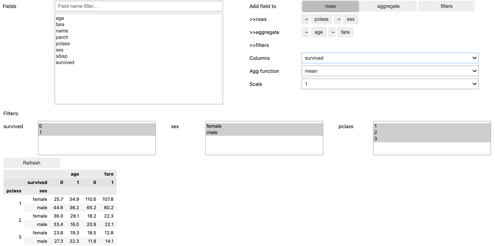

# Interactive Pivot for Jupyter

## Motivation
Interactive pivot table for strict corporate environment with limited availability of 3d party libraries. This code doesn't download anything from internet like js libraries an so on.

## Features

1. Simple api: call interactive_pivot(your_data_frame)
2. Use multiple columns to compose index
3. Change order of columns that compose index
4. Scale factor
5. Report layout is stored in global variable. No need to setup fields again after you re-run data gathering query 
6. Text filter for fields selector

## Demo
